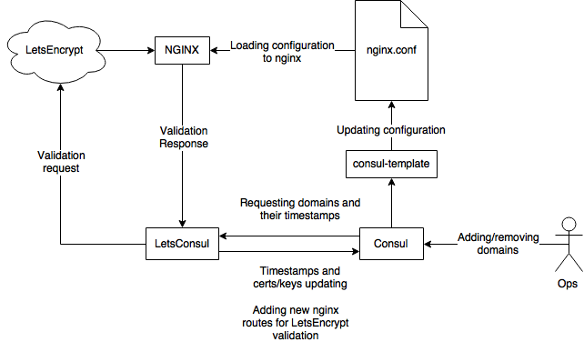

# Letsconsul

**STATUS:** *prototyping/experimental*

Tool that helps you automatically renew LetsEncrypt certificates and serve them in consul K/V storage.

*Note: It is tightly integrated with proxy-server (nginx in this case) and `consul-template` tool. Please read below for full understanding of certificate issuing and installation process.*

## Get started

At first create following K/V structure in Consul:

```
letsconsul
|_
  \_domains
    |_
    | \_example.com
    |   |_
    |     \_domain_list = ["www.example.com", "example.com"]
    |_
      \_qlean.ru
        |_
          \_domain_list = ["qlean.ru", "www.qlean.ru", "assets.qlean.ru"]
```

When letsconsul starting it reading particular environment variables:

- `BIND` - host:port variable that server will listen (e.g BIND=0.0.0.0:21234)
- `RENEW_INTERVAL` - domain certificate expiration time (e.g. RENEW_INTERVAL=168h)
- `RELOAD_INTERVAL` - time after letsconsul reloading domains information from consul (e.g. RELOAD_INTERVAL=10s)
- `CONSUL_PREFIX` - consul folder where domains serving (e.g. CONSUL_PREFIX=letsconsul/domains)
- `CONSUL_SERVICE` - consul service name (e.g. CONSUL_SERVICE=letsconsul)

Example of usage:

```
$ go build
$ BIND=0.0.0.0:21234 RENEW_INTERVAL=168h RELOAD_INTERVAL=10s CONSUL_PREFIX=letsconsul/domains CONSUL_SERVICE=letsconsul letsencrypt
```

After app starts, it fetching domains information from consul by given `CONSUL_PREFIX` env variable, checking certificate expiration time and if more than `RENEW_INTERVAL` then starts certificate renew process.

You can see full workflow on following chart:



